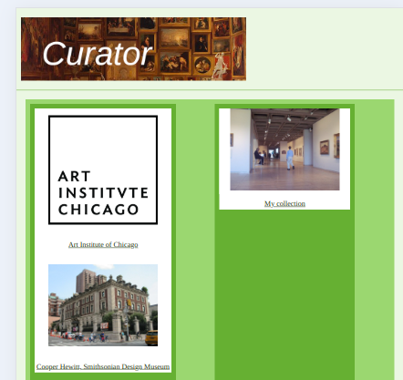
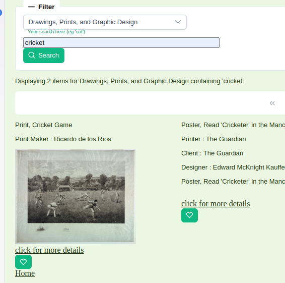

# Curator

Curator is a web application generated with Angular.

It allows the user to view artworks in multiple collections (currently configured for the Art Institute of Chicago and the Cooper Hewitt Smithsonian Design Museum) and select or "like" items from them which appear in the user's own collection ("My Collection").

## Usage

On loading, the Home screen appears. There are two columns: the left hand column displays the collections as configured, and "My Collection" is on the right. 

If you click on "Art Institute of Chicago", it opens filtered to "Paintings". There is a select box allowing the user to filter to other artwork types, along with a search text box.

Returning to the home page and clicking on "Cooper Hewitt", a search for "Yorkshire" in the Cooper Hewitt collection sadly matches no items:

However, a search for "cricket" does! Note the "like" heart button - clicking on this adds the item to "My Collection".

Different collections offer different options for searching their data, so the developer may offer varying filter options applicable to each collection.

Back to the "Home" page having "liked" items in both collections - you can now click on "My Collection" to see your curated list.

## For Developers

This project was generated with [Angular CLI](https://github.com/angular/angular-cli) version 18.0.7.

### Installation

To install this project locally:

Clone the repository:
`git clone https://github.com/LouisaWhitton/Curator.git`

Install dependencies:
`npm install`

### Development server

Run `ng serve` for a dev server. Navigate to `http://localhost:4200/`. The application will automatically reload if you change any of the source files.

### Build

Run `ng build` to build the project. The build artifacts will be stored in the `dist/` directory.

### Further help

To get more help on the Angular CLI use `ng help` or go check out the [Angular CLI Overview and Command Reference](https://angular.dev/tools/cli) page.
